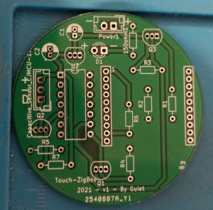
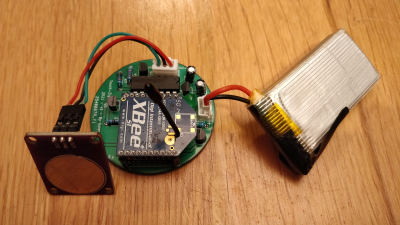
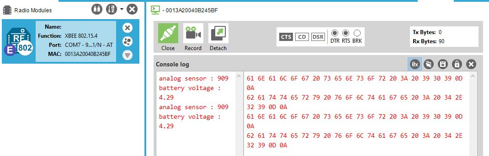
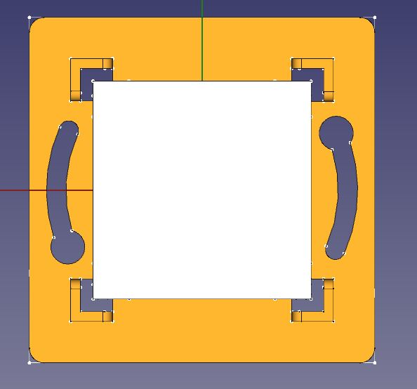
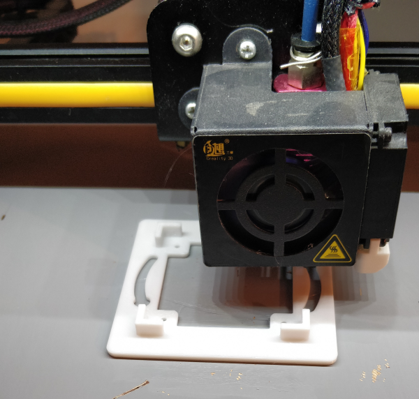
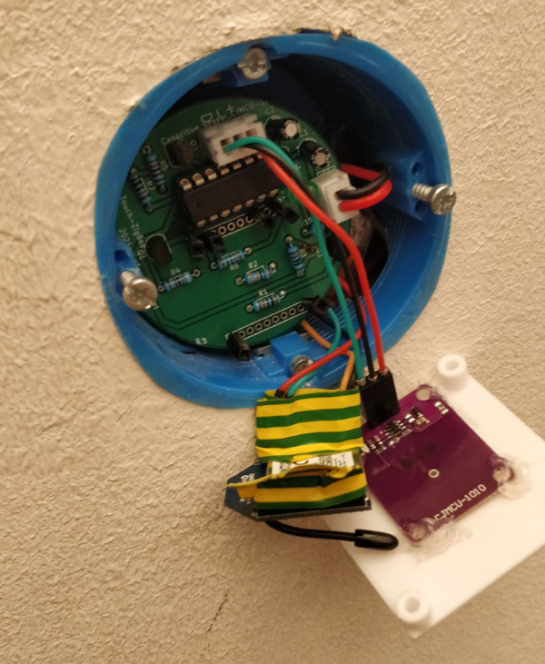
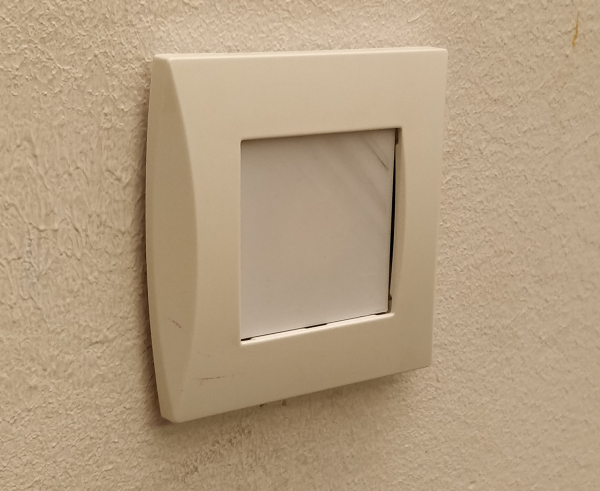

#  Touch-Zigbee

## Forewords

This project aims at creating a ultra low powered capacitive XBee enabled touch button.

It can be used to replace mechanical on/off switch to turn on/off a lamp for instance.

Mecanical swich should be me removed and wire connected so that the lamp is always ON.

Less than 10 uA is required to make this stuff work :)

__My Use case :__

I have got a Hue lamp in my office. 

Hue lamp can be switch off and on thank to the Philips Hue API.

So I am gonna replace the mecanical on/off swith by the Touch-Zigbee switch.

Here is the workflow:

Touch-Zigbee capacitive switch sends a message to a zigbee reveiver plugged in a Rapsberry.

A nodered flow will listen to the ZigBee messages and call the Philips Hue API to turn the Hue lamp on and off.

Obviously, the API or Nodered communicates with Home Assitant so I can see the Philips Hue Lamp status.

Moreover, I can programm some scenes when not at home to simulate that somebody is at home.

## Documentation

Here is some notes I took when I realized this project : [Project Notes](documentation/touch-zigbee.md)

## Illustrations

* Bare PCB received from JLCPCB and realized with KiCAD 5.1.12

Diameter : only 5 cm (can be insert in a standard French mecanical on/off switch case)

* Assembled PCB 

* Testing XBee communication with XCTU

NB : Version 2.0.0 of this project use XBee API Mode 2 (as you can see of the picture below I was using transparent mode before (AT))

Battery voltage can be read and send :) Nice

A led is blinking when the capacitive sensor is touched :)

* Wall plug design in FreeCAD

* 3D Printing wallplug (not the last version)

* Assembling the whole stuff (I do not have the XBee pin header at you can see, it is coming from China)

* Everything in place (last version remove the little gaps)

