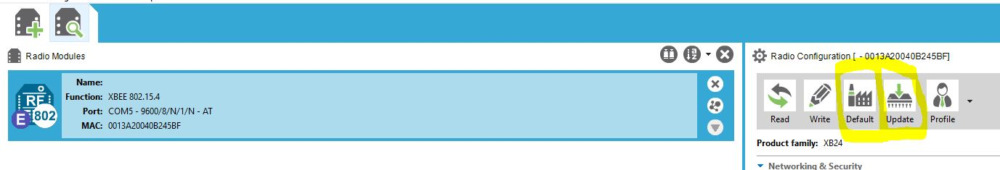
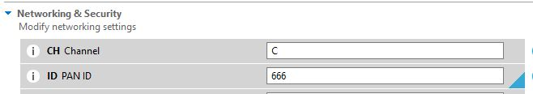
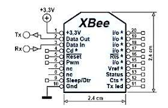
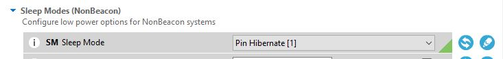
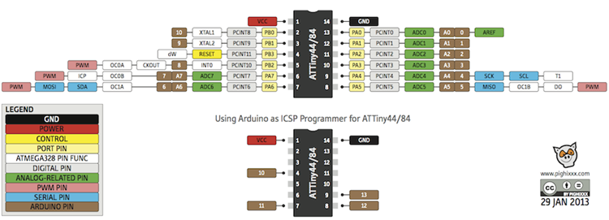

# Touch-Zigbee

## Consumption

* CMJMCU-1010 and 7333-LDO 

With tiny led that indicates power on is on

        Consumption : 1.2 mA (no touch)

        Consumption : 2.3 mA (touch + touch led indicator is on)

When tiny led with tiny led that indicates power on is removed

        Consumption : < 10uA (no touch)

        Consumption : around 1.2 mA (touch + touch led indicator is on)

* ATtiny 84 + green led and 150ohm reistor

        Consumption : 1.2 mA (green led off)

        Consumption : 8.5 mA (green led on)

* ATtiny 84 alone (sleep mode, no ADC)

        Consumption : 1.6uA

* ATtiny 84 + XBee (no sleep)

        Consumption : 52 mA

* ATtiny 84 + XBee (sleep)

        Consumption : around 4uA

* ATiny 84 (sleep mode) + XBee (sleepmode) + CMJMCU-1010

        Consumption : Peak at 20 uA when touching then less than 10 uA :)

## Configuring XBee S1 with XCTU v6.5.6

I am using old XBee S1

### XBee firmware update

Update the XBee firmware with last version using XCTU v6.5.6

In my case as of 2021/11 :

To make the Xbee talks to each other just config them with the same Channel and PAN (Personnal Area Network ID). Messages will be broadcasted.

### XBee pinout

### Sleep mode

To config the Xee to use the sleep mode, just change the sleep mode setting

Sleep mode will be control by pin 9, see <https://www.digi.com/resources/documentation/Digidocs/90001456-13/reference/r_wk_sleep_mode.htm>

PIN 9 HIGH : Xbee sleeps
PIN 9 DOWN : Xbee awake

## Read battery voltage

https://gist.github.com/dwhacks/7208805

## Pull up / pull down

Quick reminder if pullup/pulldown : <https://arduino.developpez.com/cahiers-pratiques/resistance-pullup-pulldown/>

## Interrupt and power saving stuffwith ATtiny 85

See <https://forum.arduino.cc/t/attiny84-sleep-issues/199824/8>
See <http://www.gammon.com.au/power>
See <https://www.marcelpost.com/wiki/index.php/ATtiny84_ADC>

Extract from ATtiny datasheet p49.

²> 9.2 External Interrupts
> Note that recognition of falling or rising edge interrupts on INT0 requires the presence of an
> I/O clock, as described in “Clock Sources” on page 25.

## Add SoftSerial to the Arduino IDE

I am using the SoftSerial that comes with the Arduino IDE : See <C:\Users\fguie\AppData\Local\Arduino15\packages\arduino\hardware\avr\1.8.3\libraries\SoftwareSerial>

It may be possible to use another one:

See : <https://github.com/shimniok/ATtinySoftSerial>

See <https://www.arduino.cc/en/guide/libraries>, Manual installation

1. Go to File, Preferences and get the sketchbook location
2. Copy the library to the libraries folder (in my case `C:\Users\fguie\Documents\Arduino\libraries`)

## Program the ATtiny XX (ATtiny 84 in my case) using Arduino IDE

See <https://github.com/damellis/attiny>
See <http://highlowtech.org/?p=1695>
See <http://highlowtech.org/?p=1706>

Arduino used as an ISP (In System Programmer)

1. Select the Arduino Uno Board, then upload ISP sketch to the Arduino
2. follow this wiring diagram : <https://www.instructables.com/Using-the-Arduino-Uno-to-program-ATTINY84-20PU/> or <https://42bots.com/tutorials/programming-attiny84-attiny44-with-arduino-uno/> (See image below)

Don't forget to set Programmer : Arduino As ISP and select the ATtiny 84 Board

To program:

VCC (3.3v ou 5V) <=> VCC (pin1)

GND <=> GND (pin14)

Arduino Pin 10 <=> RESET 

Arduino Pin 11 <=> pin7 (arduino pin 6)

Arduino Pin 12 <=> pin8 (arduino pin 5)

Arduino Pin 13 <=> pin9 (arduino pin 4)

## Kicad

Ref:

Ce tuto : <https://www.youtube.com/watch?v=RpVIrzEUsIM&t=1837s>

__Grandes étapes__

1. Remplir le cartouche

Fichier, Ajustage page

2. Place all your components

Shortcut

M : Move
R : Rotate
Tab  : Pour bouger le composant avec les fils accrochés

3. Annotation de la schématique (pour numéroter les composants)

4. Assigner les empreintes des composants de la schématique

5. Génération de la net liste

6. Editeur de circuit imprimé et lecture de la net liste

7. Placement des composants

8. Couche Edge cut (contour de carte)

9. Routage

Couche F. Cu (Front en rouge couche du dessus)
Couche B. Cu (Front en vert couche du dessous)

Fichiers, Options CI, Classe d'Equipots, j'utilise 0.762 comme largeur de piste

Ne pas relier les GND, ca sera automatique avec le plan de masse

10 . Serigrafie avec couche Drawing User pour mettre les indications + - et autres

11 . Générer les fichiers Gerber, Fichier Tracer (ne pas oublier de générer le fichier de percage)

12 . Faire un Zip et envoyer sur JLCPCB par exemple

## References 

* [Communication XBee](https://www.redohm.fr/2015/03/communication-xbee/)
* [Configuration XBee](https://www.electro-info.ovh/configuration-d-un-module-XBEE-avec-XCTU)
* [Un programme qui ressemble a ce que je fais](https://github.com/cano64/ATTiny85-ATTiny84-BMP085-Arduino-Library-FastAltitude/issues/1)
* [How works a switch without neutral](https://www.youtube.com/watch?v=VNYcD7MEp4A)